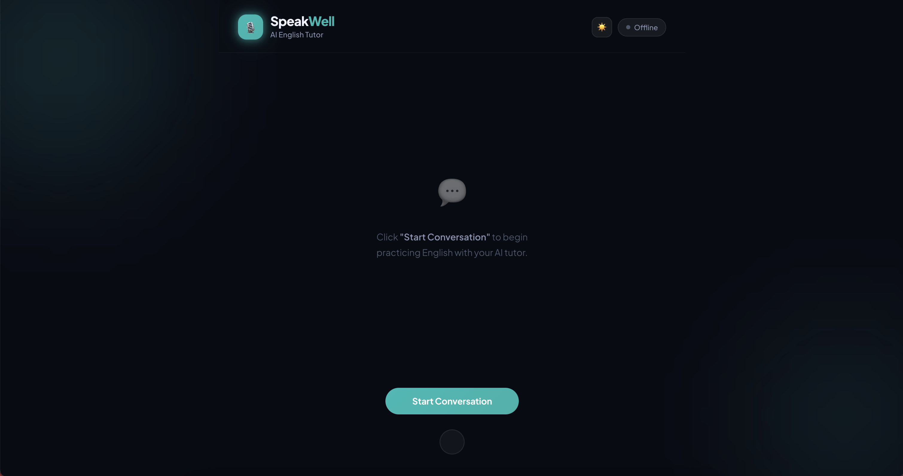

# SpeakWell



A real-time voice AI web app for practicing English conversation with an AI tutor. Users speak naturally with the AI, which listens, responds via voice, and displays a live transcript on screen.

## Architecture

```
Browser (React + WebRTC)
    ↕
Pipecat Pipeline Server (FastAPI, port 7860)
    ↕               ↕               ↕
Qwen3-ASR       GPT-4o LLM      Qwen3-TTS
(STT, port 8001)                 (TTS, port 8002)
```

**Pipeline flow:** Audio in → Speech-to-Text → LLM → Text-to-Speech → Audio out

## Tech Stack

| Layer | Technology |
|-------|-----------|
| Frontend | React 19, TypeScript, Vite, Pipecat React SDK |
| Transport | WebRTC via Pipecat SmallWebRTC |
| Backend | FastAPI + Pipecat pipeline orchestration |
| LLM | OpenAI GPT-4o |
| STT | [Qwen3-ASR](https://github.com/QwenLM/Qwen3-ASR) (local GPU, OpenAI-compatible API) |
| TTS | [Qwen3-TTS](https://github.com/QwenLM/Qwen3-TTS) (local GPU, VoiceDesign) |
| VAD | Silero VAD (voice activity detection) |

## Prerequisites

- Python 3.12+ (recommended for inference servers)
- Node.js 18+
- NVIDIA GPU with CUDA 12.x (tested on RTX PRO 6000 Blackwell, 98GB VRAM)
- OpenAI API key

## Project Structure

```
speakwell/
├── inference/                    # Local GPU inference servers
│   ├── stt_server.py             # Qwen3-ASR STT server (port 8001)
│   ├── tts_server.py             # Qwen3-TTS server (port 8002)
│   └── requirements.txt          # Inference dependencies
├── server/
│   ├── bot.py                    # FastAPI app + Pipecat pipeline
│   ├── prompts.py                # English tutor system prompt
│   ├── services/
│   │   ├── qwen3_stt.py          # Custom Pipecat STT service → Qwen3-ASR
│   │   └── qwen3_tts.py          # Custom Pipecat TTS service → Qwen3-TTS
│   └── requirements.txt
├── client/
│   ├── src/
│   │   ├── App.tsx               # PipecatClientProvider setup
│   │   └── components/
│   │       ├── ChatInterface.tsx  # Transcript + connect/disconnect
│   │       └── AudioIndicator.tsx # Visual speaking/listening state
│   ├── package.json
│   └── vite.config.ts            # Proxies /api → backend
└── spec/                         # Implementation specifications
```

## Setup

### 1. Inference Servers (GPU)

The inference servers run the Qwen3 models on your local GPU. Both models share a single GPU (~7-8GB combined VRAM usage).

```bash
cd inference
pip install -r requirements.txt
```

Models are downloaded automatically from HuggingFace on first run.

**STT Server (port 8001)** — Qwen3-ASR-1.7B with vLLM backend:
```bash
python stt_server.py
```

**TTS Server (port 8002)** — Qwen3-TTS-12Hz-1.7B-VoiceDesign with transformers backend:
```bash
python tts_server.py
```

Verify both are running:
```bash
curl http://localhost:8001/health
curl http://localhost:8002/health
```

### 2. Backend (Pipeline Server)

```bash
cd server
pip install -r requirements.txt
```

### 3. Frontend

```bash
cd client
npm install
```

## Running

Start all services in order (each in a separate terminal):

```bash
# Terminal 1: STT inference server
cd inference
python stt_server.py

# Terminal 2: TTS inference server
cd inference
python tts_server.py

# Terminal 3: Pipeline server
export OPENAI_API_KEY=sk-...
cd server
uvicorn bot:app --host 0.0.0.0 --port 7860

# Terminal 4: Frontend dev server
cd client
npm run dev
```

Open `http://localhost:5173`, click **Start Conversation**, and grant microphone access.

## Environment Variables

| Variable | Default | Description |
|----------|---------|-------------|
| `OPENAI_API_KEY` | — | OpenAI API key (required) |
| `ASR_URL` | `http://localhost:8001/v1/chat/completions` | Qwen3-ASR endpoint |
| `TTS_URL` | `http://localhost:8002/tts` | Qwen3-TTS endpoint |
| `LLM_MODEL` | `gpt-4o` | OpenAI model name |
| `TTS_SPEAKER` | `Ryan` | TTS voice preset (mapped to voice design instruction) |
| `PORT` | `7860` | Backend server port |

## Inference API Reference

### STT Server (port 8001)

| Endpoint | Method | Description |
|----------|--------|-------------|
| `/health` | GET | Health check |
| `/v1/chat/completions` | POST | OpenAI-compatible transcription (used by pipeline) |
| `/v1/transcribe` | POST | Standalone file transcription (multipart upload) |
| `/v1/transcribe/batch` | POST | Batch file transcription |

### TTS Server (port 8002)

| Endpoint | Method | Description |
|----------|--------|-------------|
| `/health` | GET | Health check |
| `/tts` | POST | Pipeline-compatible synthesis (returns raw PCM + X-Sample-Rate header) |
| `/v1/synthesize` | POST | Standalone synthesis (returns WAV/MP3) |
| `/v1/synthesize/batch` | POST | Batch synthesis (returns ZIP) |
| `/v1/voices/languages` | GET | List supported languages |

### TTS Voice Presets

The VoiceDesign model translates speaker names into voice descriptions:

| Speaker | Voice Description |
|---------|------------------|
| `Ryan` | A confident, warm adult male voice with clear articulation and a friendly tone |
| `Vivian` | A bright, cheerful young female voice with a warm and engaging tone |

Custom voices can be specified via the `/v1/synthesize` endpoint using the `instruct` field with a natural language voice description.

## License

MIT
